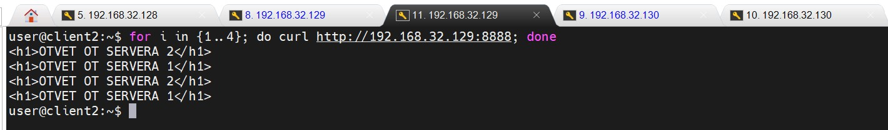
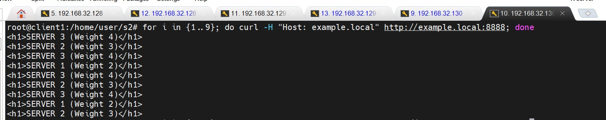
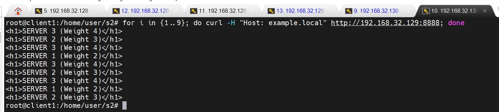
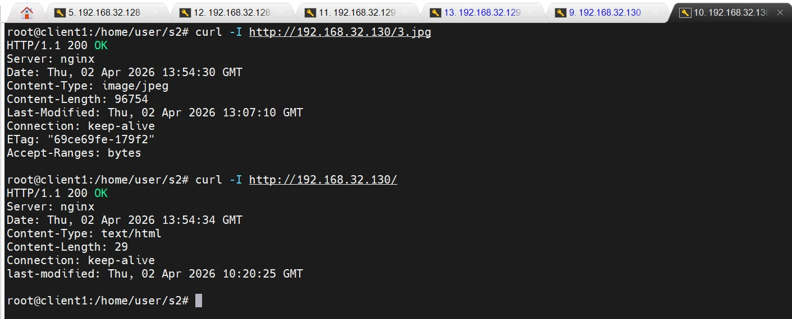
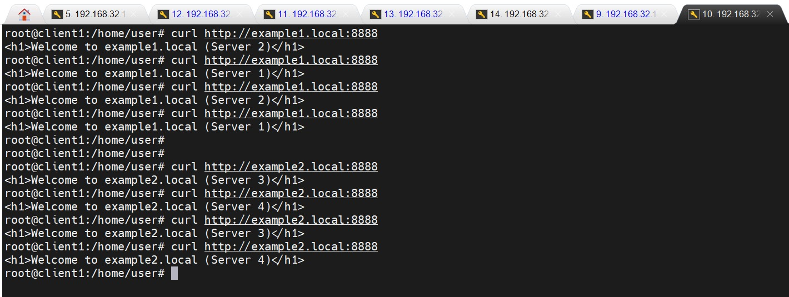

# Домашнее задание к занятию 2 «Кластеризация и балансировка нагрузки» - Бобков Александр
<details>
<summary><b>Задание 1</b></summary>

- Запустите два simple python сервера на своей виртуальной машине на разных портах
- Установите и настройте HAProxy, воспользуйтесь материалами к лекции
- Настройте балансировку Round-robin на 4 уровне.
- На проверку направьте конфигурационный файл haproxy, скриншоты, где видно перенаправление запросов на разные серверы при обращении к HAProxy.

### ОТВЕТ:
- Цель - настройка балансировки HAProxy (L4)

## 1. Запуск Python-серверов
Для имитации двух бэкенд-серверов были созданы две директории с уникальными файлами `index.html`. Серверы запущены на портах 8001 и 8002.

**Команды запуска:**
```bash
# Подготовка файлов на сервере s1 (192.168.32.129) и s2 (192.168.32.130)
#### На сервере s1
mkdir -p /home/user/s1
#### На сервере s2
mkdir -p /home/user/s2
#### На сервере s1
echo "<h1>HELLO FROM SERVER 1</h1>" > /home/user/s1/index.html
#### На сервере s2
echo "<h1>HELLO FROM SERVER 2</h1>" > /home/user/s2/index.html

# Запуск серверов в фоновом режиме
#### На сервере s1
cd /home/user/s1 && python3 -m http.server 8001 --bind 0.0.0.0 &
#### На сервере s2
cd /home/user/s2 && python3 -m http.server 8002 --bind 0.0.0.0 &
```
#### 2. Конфигурационный файл haproxy (/etc/haproxy/haproxy.cfg) был отредактирован (добавлены параметры)  для работы на 4 уровне (TCP) с использованием алгоритма Round-robin. Балансировщик принимает запросы на порту 8888 (так как порт 80 занят Nginx).
* **Proxy сервер развернут на 192.168.32.129 где и запущен один из python серверов (на s1)**

```conf
# Описываем входную точку, куда будут приходить запросы от пользователя
frontend main_frontend
    # Слушать на всех интерфейсах (IP) на стандартном 80-м порту
    bind *:8888
    # Работа на 4-м уровне (TCP), как указано в задании
    mode tcp
    # Указываем, какой группе серверов передавать трафик
    default_backend python_servers

# Описываем группу серверов, между которыми будем балансировать
backend python_servers
    # Режим работы (должен совпадать с frontend)
    mode tcp
    # Алгоритм балансировки: по очереди (первый, второй, первый, второй...)
    balance roundrobin
    # Первый сервер (на IP и порту 8001) с проверкой доступности
    server server1 192.168.32.129:8001 check #check -отслеживает жив ли сервер
    # Второй сервер (на IP и порту 8002) с проверкой доступности
    server server2 192.168.32.130:8002 check #check -отслеживает жив ли сервер
```
#### Запустим проверку 
```bash 
for i in {1..4}; do curl http://192.168.32.129:8888; done
``` 

<summary>Результат проверки на скриншоте</summary>


<details>
<summary>Для себя отсылка к заданию с keepalived</summary>

## Как работает эта связка c keepalived:

1. Мониторинг: Keepalived на «Мастере» постоянно проверяет (актуально если 2 и более сервера с HAProxy): «Работает ли мой локальный HAProxy?».
2. Реакция: Если скрипт возвращает ошибку (HAProxy упал), Keepalived понимает, что этот сервер больше не годен для работы.
3. Переезд IP: Он передает  Virtual IP второму серверу (Backup) c HAProxy.
4. Результат: Пользователи продолжают заходить на тот же IP, но попадают уже на второй HAProxy, который «живой».
- **У HAProxy и Keepalived  разные специализации:**
- Keepalived — это «грубый» инструмент. Он умеет только переключать IP-адрес с одной машины на другую (Failover). Он не умеет балансировать трафик между 10 разными серверами одновременно.
- HAProxy — это «тонкий» инструмент. Он умеет анализировать трафик, разделять его по весам, следить за сессиями пользователей и балансировать нагрузку (Load Balancing).

</details>

</details>

------
------


<details>
<summary><b>Задание 2</b></summary>

- Запустите три simple python сервера на своей виртуальной машине на разных портах
- Настройте балансировку Weighted Round Robin на 7 уровне, чтобы первый сервер имел вес 2, второй - 3, а третий - 4
- HAproxy должен балансировать только тот http-трафик, который адресован домену example.local
- На проверку направьте конфигурационный файл haproxy, скриншоты, где видно перенаправление запросов на разные серверы при обращении к HAProxy c использованием домена example.local и без него.

------

### ОТВЕТ:

## 1. Запуск Python-серверов
Для имитации трех бэкенд-серверов были созданы директории с уникальными файлами `index.html`. Серверы запущены на портах > ```8002```

**Команды запуска:**
```bash
# Подготовка файлов на сервере s1 (192.168.32.129) и s2 (192.168.32.130) и s3 (192.168.32.128)
#### На сервере s1
mkdir -p /home/user/s1
#### На сервере s2
mkdir -p /home/user/s2
#### На сервере s3
mkdir -p /home/user/s3
#### На сервере s1
echo "<h1>SERVER 1 (Weight 2)</h1>" > /home/user/s1/index.html
#### На сервере s2
echo "<h1>SERVER 2 (Weight 3)</h1>" > /home/user/s2/index.html
#### На сервере s3
echo "<h1>SERVER 3 (Weight 4)</h1>" > /home/user/s3/index.html
# Запуск серверов в фоновом режиме
#### На сервере s1
cd /home/user/s1 && python3 -m http.server 8002 --bind 0.0.0.0 &
#### На сервере s2
cd /home/user/s2 && python3 -m http.server 8002 --bind 0.0.0.0 &
#### На сервере s3
cd /home/user/s3 && python3 -m http.server 8002 --bind 0.0.0.0 &
```

#### 2. Конфигурационный файл haproxy (/etc/haproxy/haproxy.cfg) был отредактирован (добавлены параметры)  для работы c ACL и весом>
* **Proxy сервер развернут на 192.168.32.129 где и запущен один из python серверов (на s1)**
```conf
# --- Секция FRONTEND (Прием запросов) ---
frontend http_frontend
    # Слушаем на порту 8888 (так как 80 занят nginx)
    bind *:8888
    # Указываем 7-й уровень (HTTP), чтобы читать заголовки доменов
    mode http

    # Создаем ACL (список доступа) с именем "is_example_local"
    # Проверяем заголовок 'Host' на соответствие домену 'example.local'
    # Флаг -i делает проверку нечувствительной к регистру
    acl is_example_local hdr(host) -i example.local

    # Условие: перенаправлять трафик на группу серверов 'weighted_servers',
    # ТОЛЬКО ЕСЛИ запрос пришел на домен example.local
    use_backend weighted_servers if is_example_local

# --- Секция BACKEND (Распределение с весами) ---
backend weighted_servers
    # Режим должен совпадать с frontend
    mode http
    # Алгоритм Round Robin (с учетом весов)
    balance roundrobin

    # Настройка серверов с указанными весами (weight)
    # server1 получит 2 запроса из 9 (вес 2)
    server s1 192.168.32.129:8002 weight 2 check
    # server2 получит 3 запроса из 9 (вес 3)
    server s2 192.168.32.130:8002 weight 3 check
    # server3 получит 4 запроса из 9 (вес 4)
    server s3 192.168.32.128:8002 weight 4 check
```
- Добавить запись в hosts на каждом сервере:
```bash
echo "192.168.32.129 example.local" | sudo tee -a /etc/hosts
```
#### Запустим проверку
```bash
for i in {1..9}; do curl -H "Host: example.local" http://example.local:8888; done
```
<summary>Результат проверки на скриншоте</summary>


#### Проверим, что не проходят проверки если обращаться по ip адресу, ACL значит отрабатывает, у нас Пропускать запросы, только если в заголовке написано example.local.

<summary>Результат проверки обращения по ip на скриншоте</summary>


<details>
<summary>Для себя если два сайта(web ресурса)</summary>

- Допустим, у нас есть два разных проекта: example.local и test.local, тогда конфиг будет:

```conf
frontend http_frontend
    bind *:8888
    mode http

    # 1. Определяем ACL для разных доменов
    acl host_example hdr(host) -i example.local
    acl host_test    hdr(host) -i test.local

    # 2. Распределяем трафик по разным бэкендам
    use_backend servers_example if host_example
    use_backend servers_test    if host_test

# Бэкенд для первого сайта (с весами)
backend servers_example
    mode http
    balance roundrobin
    server s1 192.168.32.129:8001 weight 2 check
    server s2 192.168.32.130:8002 weight 3 check

# Бэкенд для второго сайта (совсем другие серверы)
backend servers_test
    mode http
    server s3 192.168.32.128:8003 check
```
Как это работает для пользователя:

    Если набрать http://example.local:8888 — попадешь на балансировку между 1 и 2 серверами.
    Если набрать http://test.local:8888 — попадешь только на 3-й сервер.
    Если набрать просто IP — HAProxy выдаст ошибку, так как не поймет, какой сайт нужен.
</details>
</details>

-------
-------

<details>
<summary><c>Задание 3*</c></summary>
- Настройте связку HAProxy + Nginx как было показано на лекции.
- Настройте Nginx так, чтобы файлы .jpg выдавались самим Nginx (предварительно разместите несколько тестовых картинок в директории /var/www/), а остальные запросы переадресовывались на HAProxy, который в свою очередь переадресовывал их на два Simple Python server.
- На проверку направьте конфигурационные файлы nginx, HAProxy, скриншоты с запросами jpg картинок и других файлов на Simple Python Server, демонстрирующие корректную настройку.

-------

### ОТВЕТ:


## 1. Запуск Python-серверов
- Для имитации трех бэкенд-серверов были созданы директории с уникальными файлами `index.html`. Серверы запущены на портах 8006


**Команды запуска:**
```bash
# Подготовка файлов на сервере s1 (192.168.32.129) и s2 (192.168.32.130)

#### На сервере s1
mkdir -p /home/user/s1
#### На сервере s2
mkdir -p /home/user/s2
#### На сервере s1
echo "<h1>SERVER 1</h1>" > /home/user/s1/index.html
#### На сервере s2
echo "<h1>SERVER 2</h1>" > /home/user/s2/index.html
# Запуск серверов в фоновом режиме
#### На сервере s1
cd /home/user/s1 && python3 -m http.server 8002 --bind 0.0.0.0 &
#### На сервере s2
cd /home/user/s2 && python3 -m http.server 8002 --bind 0.0.0.0 &
```
## 2. Устанавливаем NGINX на хосте 192.168.32.130, HAPRoxy остается на 192.168.32.129
```bash
sudo apt install nginx
```
- **Создаем каталог по пути /var/www/images и кладем туда картинку с расширением .jpg**

### 3. Вносим изменения в конфигурационный файл NGINX (на 192.168.32.130) ```(/etc/nginx/sites-available/default)```

```conf
server {
    # Слушать 80-й порт (стандартный для интернета)
    listen 80;

    # Имя нашего сайта. Если в браузере введут другое — Nginx может не ответить
    server_name example.local;

    # --- КАРТИНКИ (.jpg или .jpeg) ---
    # ~* означает "искать совпадение в тексте ссылки, не обращая внимания на большие/маленькие буквы"
    # \.(jpg|jpeg)$ — если ссылка заканчивается на .jpg или .jpeg
    location ~* \.(jpg|jpeg)$ {
        # Где лежат картинки на жестком диске этого сервера
        root /var/www/images;

        # Попробовать отдать файл ($uri). Если его нет — выдать ошибку 404
        try_files $uri =404;
    }

    # --- ВСЁ ОСТАЛЬНОЕ (кроме картинок) ---
    # Слэш "/" означает любой другой запрос (текст, главная страница и т.д.)
    location / {
        # Переслать запрос на другой сервер, где живет наш HAProxy
        # IP моего
        proxy_pass http://192.168.32.129:8888;

        # Передать оригинальное имя сайта (чтобы HAProxy не запутался)
        proxy_set_header Host $host;

        # Передать реальный IP-адрес пользователя (чтобы сервер видел, кто зашел)
        proxy_set_header X-Real-IP $remote_addr;
    }
}
```
 
## 4. Вносим изменения в конфигурационный файл HAPRoxy (на 192.168.32.129) ```(/etc/haproxy/haproxy.cfg)```

```conf
# Секция FRONTEND — как мы принимаем запросы от Nginx
frontend main_frontend
    # Слушать порт 8888 на всех сетевых интерфейсах (*) этой машины
    bind *:8888
    # Работать в режиме HTTP (чтобы понимать команды браузера)
    mode http
    # Отправлять всех пришедших в "группу серверов" под названием python_servers
    default_backend python_servers

# Секция BACKEND — куда мы отправляем запросы дальше
backend python_servers
    # Режим тоже HTTP
    mode http
    # Алгоритм "по очереди" (одному, второму, одному, второму...)
    balance roundrobin
    # Первый наш Python-сервер (он тут же, на этой же машине, порт 8001)
    # check — проверять, не "упал" ли сервер
    server s1 192.168.32.129:8002 check
    # Второй наш Python-сервер (порт 8002)
    server s2 192.168.32.130:8002 check
```

## 5. Перезапускаем службы NGINX и HAPRoxy на соответсвующих серверах:
```bash
sudo systemctl restart haproxy.service
sudo systemctl restart nginx
```

## 6. Проверяем работоспособность:

<summary>Результат проверки на скриншоте</summary>


<details>
<summary>Расшифровка результата на скриншоте</summary>

    Первый запрос (/3.jpg):
        HTTP/1.1 200 OK и Server: nginx.
        Вывод: Nginx сам нашел картинку в /var/www/images/ и отдал её. HAProxy в этом не участвовал. Цель достигнута.
    Второй запрос (/):
        HTTP/1.1 200 OK и Server: nginx.
        Вывод: Nginx принял запрос, понял, что это не картинка, и пробросил его на HAProxy (proxy_pass). HAProxy в свою очередь забрал ответ у Python-сервера и вернул его вам через Nginx.
        Content-Length: 29 — это как раз размер  строки в ранее созданном файле index.hrml (<h1>SERVER X</h1>).

</details>

</details>

------
------


<details>
<summary><c>Задание 4*</c></summary>

- Запустите 4 simple python сервера на разных портах.
- Первые два сервера будут выдавать страницу index.html вашего сайта example1.local (в файле index.html напишите example1.local)
- Вторые два сервера будут выдавать страницу index.html вашего сайта example2.local (в файле index.html напишите example2.local)
- Настройте два бэкенда HAProxy
- Настройте фронтенд HAProxy так, чтобы в зависимости от запрашиваемого сайта example1.local или example2.local запросы перенаправлялись на разные бэкенды HAProxy
- На проверку направьте конфигурационный файл HAProxy, скриншоты, демонстрирующие запросы к разным фронтендам и ответам от разных бэкендов.


------
### ОТВЕТ:

## 1.  Подготовка 4 серверов

- Создаю 4 папки и запускаю серверы. Использую порты 8001-8004. Порты 8001 и 8002 буду использовать на сервере с HAPRoxy чтобы не разворачивать 4 виртуальную машину


##### На сервере s1 на котором HAPRoxy (192.168.32.129) создаю 2 каталога и внутри файлы index.html с содержимым:
```bash
mkdir -p ~/site1_1 ~/site1_2
echo "<h1>Welcome to example1.local (Server 1)</h1>" > ~/site1_s1/index.html
echo "<h1>Welcome to example1.local (Server 2)</h1>" > ~/site1_s2/index.html
111
```

##### На сервере s1 запускаю python сервер на портах 8001 и 8002
```bash
cd ~/site1_s1 && python3 -m http.server 8001 --bind 0.0.0.0 &
cd ~/site1_s2 && python3 -m http.server 8002 --bind 0.0.0.0 &
```

##### На сервере s2 (192.168.32.130) создаю 1 каталог и внутри файлы index.html с содержимым:
```bash
mkdir -p ~/site2_s3
echo "<h1>Welcome to example2.local (Server 3)</h1>" > ~/site2_s3/index.html
```
##### На сервере s2 запускаю python сервер на порту 8003
```bash
cd ~/site2_s3 && python3 -m http.server 8003 --bind 0.0.0.0 &
```
##### На сервере s3 (192.168.32.128) создаю 1 каталог и внутри файлы index.html с содержимым:
```bash
mkdir -p ~/site2_s4
echo "<h1>Welcome to example2.local (Server 4)</h1>" > ~/site2_s4/index.html
```

##### На сервере s3 запускаю python сервер на порту 8004
```bash
cd ~/site2_s4 && python3 -m http.server 8004 --bind 0.0.0.0 &
```

## 2. Конфигурация HAProxy (на  S1)(192.168.32.129)
```conf
frontend main_frontend
    bind *:8888
    mode http

    # Настраиваем ACL для разделения по доменам
    acl is_site1 base_dom example1.local
    acl is_site2 base_dom example2.local
    # Перенаправляем на нужные бэкенды
    use_backend backend_site1 if is_site1
    use_backend backend_site2 if is_site2

# Бэкенд для example1.local (оба сервера на этой же машине)
backend backend_site1
    mode http
    balance roundrobin
    server s1 127.0.0.1:8001 check
    server s2 127.0.0.1:8002 check

# Бэкенд для example2.local (серверы на удаленных машинах)
backend backend_site2
    mode http
    balance roundrobin
    server s3 192.168.32.130:8003 check
    server s4 192.168.32.128:8004 check
```

## 3. Результат проверки
<summary>Результат проверки  на скриншоте</summary>



</details>

